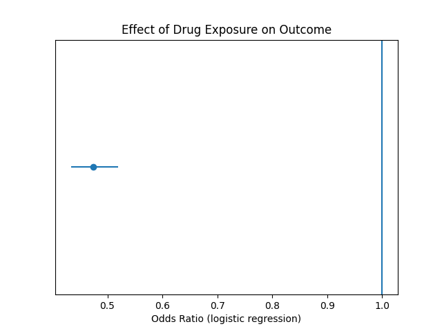

# Synthetic EHR Cohort Study (R + Python)
### A Reproducible Epidemiological Workflow in R and Python
This project simulates a synthetic electronic health record (EHR) cohort
to demonstrate reproducible epidemiological analysis using R and Python.
## Background
Routinely collected electronic health records (EHRs) are widely used in
epidemiological and health services research to evaluate treatment
effectiveness and clinical risk factors.
This project demonstrates a fully reproducible workflow using
synthetic patient-level data to estimate the association between
drug exposure and a binary clinical outcome.
The objective is to estimate the association between drug exposure
and a binary clinical outcome adjusting for age and comorbidity.
## Methods
### Study Design
A simulated retrospective cohort study was conducted using synthetic
EHR data.
### Data Generation
Patient-level data were generated in R and exported as a CSV file.
### Statistical Analysis
Logistic regression was used to estimate adjusted odds ratios (ORs)
for the association between drug exposure and outcome,
adjusting for age and comorbidity score.
All analyses were performed in Python using `statsmodels`.
## Results
### Age Distribution

The age distribution appears approximately normal,
reflecting a realistic adult primary care population.
There is adequate variability across age groups,
supporting multivariable modelling.
### Outcome by Drug Exposure

The crude proportion of the outcome was lower among
drug-exposed individuals compared to unexposed patients,
suggesting a potential protective association.

### Adjusted Effect of Drug Exposure

After adjustment for age and comorbidity,
drug exposure was associated with reduced odds of the outcome
(OR ≈ 0.47).

The confidence interval did not cross the null value,
suggesting statistical evidence of an association
within this simulated dataset.
## Interpretation

In this synthetic cohort, drug exposure was associated with
substantially lower odds of the outcome after adjustment.

These findings are consistent with a protective effect,
although causal inference cannot be established due to
the simulated nature of the data.
## Reproducibility

1. Run `scripts/01_generate_data.R`
2. Open `python_code/04_analysis_python.ipynb`
3. Run all cells to reproduce the full analysis

All outputs and figures are generated programmatically.
